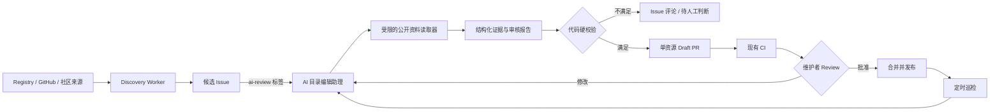
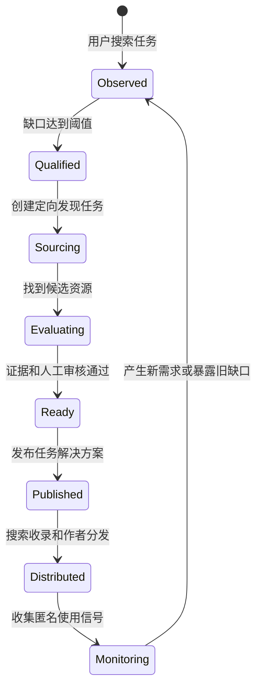

# CNMCP AI 目录编辑助理开发任务规划

状态：待评审  
适用范围：CNMCP 的资源发现、内容整理、目录维护与增长内容建设  
核心原则：AI 提供证据和草稿，代码执行硬约束，维护者拥有最终发布权

## 1. 目标

建设一个内部使用的“CNMCP AI 目录编辑助理”，把现有的自动发现候选与人工维护流程连接起来：

- 自动分析 Discovery Worker 创建的候选 Issue。
- 基于上游公开资料生成可追溯的审核报告。
- 为满足条件的候选生成单资源 Draft PR。
- 定期巡检已收录资源的维护状态、许可证、链接和说明变化。
- 分析目录覆盖缺口，起草任务页、比较页和周期内容。
- 后续提供面向用户的 CNMCP Search Skill/MCP，但不在第一阶段建设通用聊天机器人。

成功不是“AI 自动发布更多资源”，而是在不降低可信度的前提下，减少维护者搜集资料和整理格式的时间。

## 2. 范围与非目标

### 本计划包含

- 公开 GitHub 仓库中的 MCP、Skill 和 Plugin。
- 候选发现、查重、资料提取、证据整理和内容起草。
- GitHub Issue、Draft PR、CI 与人工 Review 工作流。
- 存量目录巡检、任务覆盖分析和内容草稿。
- 可测试、可审计、可限制成本的 Agent 执行框架。

### 第一阶段不包含

- 自动合并 PR 或直接修改 `main`。
- 执行第三方安装命令、构建脚本或仓库代码。
- 宣称资源已经通过安全审计。
- 根据 README 推断没有明确证据的平台兼容性。
- 让 AI 独立决定编辑精选或修改质量评分公式。
- 面向访客的开放式通用聊天机器人。
- 使用站内点击量直接影响资源质量排序。

## 3. 建议架构

建议把 Agent 作为 GitHub 原生维护流程的一部分运行。第一版优先使用 GitHub Actions 或独立 GitHub App，通过提供商适配层调用模型；不要把具体模型 SDK 散落在业务代码中。

## 4. 增长闭环开发规划

这条闭环应当实现为一个有状态、可度量的产品系统，而不是一串互不关联的定时任务：

建议使用统一的 `gapId` 贯穿搜索缺口、候选 Issue、资源 PR、任务页和使用数据，使每一次资源建设都能回答“它来自什么用户需求，发布后是否改善了这个需求”。

### 4.1 用户搜索任务

目标：把用户输入转化为可聚合的任务需求，同时控制隐私风险。

- [ ] **LOOP-101 定义任务查询事件**
  - 记录规范化任务、结果数量、筛选条件、入口页面、匿名会话标识和时间窗口。
  - 原始输入先执行长度限制、Secret 检测和个人信息清洗；默认不长期保存完整原文。
  - 验收：事件可以区分“零结果”“结果过少”“有结果但未继续操作”。

- [ ] **LOOP-102 建设任务意图归一化**
  - 第一层使用现有标签、别名和关键词进行确定性匹配。
  - AI 离线聚类无法匹配的匿名查询，提出新任务标签或别名建议，不直接修改注册表。
  - 验收：“代码评审”“Code Review”“审查 PR”等表达可以聚合到同一任务；无法判断时保留 `unknown`。

- [ ] **LOOP-103 建设搜索漏斗看板**
  - 展示查询量、零结果率、低结果率、详情点击、安装内容复制和上游访问。
  - 按任务而不是按具体用户聚合。
  - 验收：维护者能看到“用户要什么、当前提供什么、在哪一步离开”。

AI 角色：任务意图分析员。负责聚类、命名建议和异常查询摘要；不保存用户画像，不把原始敏感输入放入模型上下文。

### 4.2 暴露并排序资源缺口

目标：将零散查询转化为有限、可执行的建设队列。

- [ ] **LOOP-201 定义缺口数据模型**
  - 建议字段：`gapId`、规范化任务、查询量、结果数、有效资源数、现有最高质量、首次/最近出现时间和状态。
  - 状态采用 `observed / qualified / sourcing / evaluating / ready / published / monitoring / closed`。
  - 验收：状态转换幂等，每个缺口有唯一负责人和关联记录。

- [ ] **LOOP-202 建设缺口优先级评分**
  - 综合需求频次、零结果比例、任务价值、现有覆盖、资源过期程度和内容机会。
  - 不因单个用户重复刷新而无限加分，设置最小样本和时间衰减。
  - 验收：评分分解可解释，可人工调整优先级但必须记录原因。

- [ ] **LOOP-203 自动生成资源缺口 Issue**
  - 每周仅为超过阈值的前 N 个缺口创建 Issue，避免噪声。
  - Issue 包含需求证据、已有资源、需要发现的资源类型和成功条件。
  - 验收：同一 `gapId` 不重复开 Issue，低样本缺口只进入观察队列。

AI 角色：目录需求分析员。负责合并相似缺口、解释优先级和起草 Issue；是否投入建设由维护者确认。

### 4.3 定向发现与评测

目标：从“全网抓热门项目”升级为“围绕具体任务找最合适的候选”。

- [ ] **LOOP-301 生成定向发现策略**
  - 根据任务生成 GitHub Topics、关键词、Registry 分类和相邻资源查询。
  - 查询必须由允许的模板组合，AI 不能任意访问网络或扩大来源范围。
  - 验收：每个候选都关联 `gapId`、发现来源和命中的任务依据。

- [ ] **LOOP-302 合并主动发现与社区投稿**
  - 投稿资源进入同一查重、证据和任务匹配流程。
  - 允许一个候选解决多个缺口，但只创建一个资源 PR。
  - 验收：发现来源不同不影响质量规则，作者投稿不会获得额外排序权重。

- [ ] **LOOP-303 建设证据化评测卡**
  - 维度包括任务匹配、差异化、维护状态、许可证、文档、权限风险和平台证据。
  - 热度是成熟度信号，不代替任务效果或安全结论。
  - 验收：没有足够证据的维度显示“未知”，不能由 AI 补全为肯定结论。

- [ ] **LOOP-304 建立候选对比报告**
  - 对同一缺口的候选按统一维度并排比较。
  - 推荐动作限定为“进入 Draft PR”“继续观察”“人工核验”“不符合范围”。
  - 验收：报告保留候选被排除的原因，避免未来重复评估。

AI 角色：资源研究员和审核助理。负责搜索策略建议、资料摘要和对比；程序执行查重与硬门槛，人类确认收录价值。

### 4.4 发布任务解决方案

目标：每次收录不仅新增一张资源卡，还能形成可被搜索、分享和复用的任务答案。

- [ ] **LOOP-401 定义任务解决方案 Schema**
  - 建议包含：用户目标、适用人群、选择标准、推荐资源、比较维度、使用步骤、风险提示、更新时间和关联缺口。
  - 页面只能引用正式 Catalog 资源。
  - 验收：构建期校验资源引用、证据链接、更新时间和公开状态。

- [ ] **LOOP-402 建设任务页静态路由**
  - 生成稳定 URL、Metadata、JSON-LD、站点地图和面包屑。
  - 任务页与资源页双向链接，并提供相关任务入口。
  - 验收：页面不依赖运行时模型，搜索引擎和用户获得相同的审核内容。

- [ ] **LOOP-403 生成任务页 Draft PR**
  - 缺口进入 `ready` 后，AI 根据已审核资源和评测卡起草任务页。
  - 不得编造实测结果、用户评价或资源能力。
  - 验收：维护者审批后才进入 `published`，发布记录回写 `gapId`。

- [ ] **LOOP-404 建设方案模板层级**
  - 第一层：单任务资源清单。
  - 第二层：同类资源比较。
  - 第三层：包含多个扩展的完整工作流。
  - 验收：根据有效资源数量选择模板，资源不足时不生成伪比较页。

AI 角色：任务方案编辑。负责结构化写作、摘要和内链建议；最终推荐、措辞和发布由维护者审核。

### 4.5 搜索与作者带来新用户

目标：让每个任务方案和资源收录都生成可追踪的外部分发入口。

- [ ] **LOOP-501 建设可索引内容基础设施**
  - 确保任务页进入 sitemap，具有规范 URL、结构化数据和分享预览图。
  - 为机器使用提供只读 Catalog/任务数据，不暴露未审核候选。
  - 验收：新页面发布后能被站点地图、内部链接和静态数据源发现。

- [ ] **LOOP-502 生成作者分享包**
  - 包括中文详情链接、任务页链接、分享卡片、README 徽章和可编辑的发布文案。
  - 每个链接携带不含个人信息的来源标识。
  - 验收：AI 只生成草稿，不自动联系作者或向上游提交内容。

- [ ] **LOOP-503 建设内容复用流水线**
  - 从已发布任务页生成周报、更新摘要和社区内容草稿。
  - 所有衍生内容引用同一正式数据，资源变化后可以检测过期草稿。
  - 验收：不存在独立维护、容易失真的第二套资源事实。

- [ ] **LOOP-504 建设渠道归因**
  - 区分自然搜索、作者链接、社区内容、AI Skill/MCP 和站内推荐。
  - 只做聚合归因，不进行跨站用户画像追踪。
  - 验收：能比较渠道带来的有效使用动作，而不只比较访问量。

AI 角色：分发内容助理。负责分享素材和渠道版本草稿；对外发布和作者沟通必须人工触发。

### 4.6 使用数据改善排序

目标：利用真实使用意图发现“有热度但不好选”或“低热度但很有用”的资源，同时避免流量操纵质量排名。

- [ ] **LOOP-601 扩展匿名使用事件**
  - 在现有 `command_copy`、`source_visit` 基础上增加任务页到详情页选择、无结果和可选的“有帮助/不适合”反馈。
  - 事件协议、Worker 数据库、客户端和测试同步版本化。
  - 验收：事件去重、限流、来源校验和隐私规则完整；统计失败不影响静态站使用。

- [ ] **LOOP-602 区分质量分与使用信号**
  - 质量分继续基于可验证的项目事实和编辑审核。
  - 使用信号先用于发现问题、优化召回和安排复审，不直接提高质量分。
  - 验收：高访问但低维护资源不会因流量获得更高质量评级。

- [ ] **LOOP-603 建设抗操纵的效果报告**
  - 设置最小样本、事件去重、异常流量过滤、时间衰减和置信区间。
  - 展示任务维度的选择率，而不是公开制造资源“人气榜”。
  - 验收：小样本显示数据不足；异常事件不会触发自动排序变化。

- [ ] **LOOP-604 建立排序实验机制**
  - 先离线比较“当前质量排序”“任务匹配排序”“质量＋任务相关性排序”。
  - AI 分析差异和失败案例，排序公式由维护者批准并以代码实现。
  - 验收：每次排序调整都有测试集、指标、版本和回滚方式。

- [ ] **LOOP-605 自动回流新缺口**
  - 有搜索但无人选择、详情访问高但后续动作低、资源集中失效的任务重新进入 `observed`。
  - 验收：回流有冷却期和阈值，不产生无限循环 Issue。

AI 角色：使用信号分析员。负责异常摘要、失败案例聚类和优化建议；不能直接修改线上排序或质量事实。

### 4.7 闭环调度与可观测性

- [ ] **LOOP-701 建设事件到任务的编排器**
  - 每日聚合搜索缺口，每周产生有限的建设队列，按标签触发 AI 审核，按合并事件更新缺口状态。
  - 验收：每个步骤可重放、幂等、可暂停，并具有明确的人工接管点。

- [ ] **LOOP-702 建设端到端运行台账**
  - 关联 `gapId`、Issue、候选、PR、资源、任务页、模型版本、成本和最终结果。
  - 验收：可以追溯一次推荐从用户需求到发布与后续效果的完整路径。

- [ ] **LOOP-703 设置闭环健康指标**
  - 需求指标：零结果率、有效任务数、缺口积压。
  - 供给指标：候选命中率、审核通过率、从缺口到发布的周期。
  - 质量指标：证据缺失率、过期率、人工退回率。
  - 增长指标：任务页有效入口、作者来源访问、详情选择和使用意图动作。
  - 验收：指标用于诊断每个环节，不把单一指标设成 Agent 的无约束优化目标。

## 5. 开发任务清单

### P0：治理、安全与验收基线

- [ ] **AI-001 定义角色合同**
  - 明确允许读取的来源、允许调用的工具和允许产生的 GitHub 操作。
  - 明确 AI 只能创建审核报告、Issue 评论和 Draft PR。
  - 验收：角色合同包含输入、输出、禁止操作、人工接管条件和失败处理。

- [ ] **AI-002 建立威胁模型**
  - 把上游 README、Issue、网页和代码全部视为不可信数据。
  - 防范提示注入、恶意链接、凭据泄露、路径穿越和命令执行。
  - 验收：测试证明上游文本无法改变系统规则、触发 Shell、读取 Secret 或扩大写权限。

- [ ] **AI-003 设计最小 GitHub 权限**
  - 默认 `contents: read`、`issues: write`、`pull-requests: write`。
  - 如需创建分支，使用专用 Bot 身份和受限分支前缀；仍受默认分支保护。
  - 验收：Agent 无法直接推送或合并到 `main`，PR 工作流无法读取模型 Secret。

- [ ] **AI-004 定义结构化内部协议**
  - 为候选审核结果建立 JSON Schema，包括事实、证据 URL、置信状态、缺失字段、风险提示和建议动作。
  - 区分“上游明确声明”“GitHub API 事实”“AI 摘要”“未知”。
  - 验收：所有模型输出必须先通过 Schema 和业务规则才能进入后续步骤。

- [ ] **AI-005 建立黄金测试集**
  - 选择至少 20 个样本：可收录、重复、类型错误、无许可证、归档、兼容性模糊、含提示注入文本。
  - 维护期望分类、关键事实和拒绝原因。
  - 验收：未经证据的兼容性为 0；重复资源不得自动生成新条目；危险样本不得进入 Draft PR。

### P1：候选审核 MVP

- [ ] **AI-101 扩展候选 Issue 数据**
  - 保留来源、仓库规范化标识、类型初判、热度快照和抓取时间。
  - 添加稳定的候选 ID，保证重复运行幂等。
  - 验收：同一仓库不会因为 URL 大小写、`.git` 或尾斜杠重复创建候选。

- [ ] **AI-102 增加 `ai-review` 触发入口**
  - 第一版只响应维护者添加的标签或手动触发，不自动处理全部候选。
  - 同一 Issue 同一上游版本只运行一次，可显式要求重新分析。
  - 验收：重复事件不会产生重复评论、分支或费用。

- [ ] **AI-103 实现受限资料读取器**
  - 只读取公开 GitHub API、仓库 README、许可证和明确配置的官方文档。
  - 限制跳转、内容长度、文件类型、请求数量和超时。
  - 验收：不执行仓库代码；非 HTTPS、私网地址和异常重定向被拒绝。

- [ ] **AI-104 实现确定性查重**
  - 按规范化 repository、资源 ID、名称和已知别名比较现有目录。
  - AI 只解释疑似语义重复，不负责替代确定性查重。
  - 验收：确定性重复直接停止生成条目，并链接到已有资源。

- [ ] **AI-105 生成审核报告**
  - 输出类型判断、用途、目标人群、许可证、维护状态、兼容性证据、缺失信息和收录建议。
  - 每项可验证事实都附来源。
  - 验收：报告明确区分事实、摘要和未知，不以模型置信度替代证据。

- [ ] **AI-106 将报告回写 Issue**
  - 使用固定、可折叠的 Markdown 模板。
  - 提供“生成 Draft PR”“需要人工补充”“不建议收录”三类下一步。
  - 验收：报告可重复更新但不刷屏，保留运行版本和时间。

- [ ] **AI-107 完成 MVP 测试与成本记录**
  - 覆盖成功、超时、限流、模型错误、非法 JSON、证据缺失和重试场景。
  - 记录调用次数、输入输出量、耗时和失败类型，但不记录 Secret 或完整不可信内容。
  - 验收：单候选成本和最长执行时间可配置上限；失败不会产生半成品写操作。

### P2：从审核报告生成单资源 Draft PR

- [ ] **AI-201 复用投稿规范生成 `resource.json`**
  - 严格遵守现有 Schema、标签注册表和查重规则。
  - 不生成 `featured`、伪造审核状态或未经证据的兼容性。
  - 验收：生成文件通过 `validate:resources`。

- [ ] **AI-202 生成中文资源 README**
  - 包含解决的问题、核心能力、适合谁、使用前注意事项和官方资源。
  - 以摘要改写为主，避免长篇复制上游内容。
  - 验收：所有外链为 HTTPS；不含原始 HTML、营销徽章和无关变更记录。

- [ ] **AI-203 创建受限 Bot 分支与 Draft PR**
  - 分支统一使用 `bot/resource/<id>` 或最终确认的前缀。
  - 一个 PR 只包含一个资源目录，并带 `cnmcp-flow` 标记和关联 Issue。
  - 验收：不能修改 Schema、标签注册表、工作流或站点代码。

- [ ] **AI-204 接入现有 CI 反馈**
  - 只自动修复结构、格式和确定性校验错误。
  - 收录价值、许可证歧义、重复争议和标签争议交给维护者。
  - 验收：限制自动修复次数，不允许隐藏的无限重试或二次改写。

- [ ] **AI-205 建立人工审批清单**
  - Review 必看：类型、许可证、兼容性证据、安装文本、中文摘要、标签、重复情况。
  - 验收：没有维护者批准无法合并；批准记录可追溯。

### P3：存量资源自动巡检

- [ ] **AI-301 扩展确定性维护巡检**
  - 检查归档状态、最近推送、许可证、默认分支、README 和官方链接变化。
  - 验收：先由代码发现变化，AI 只负责解释变化和建议动作。

- [ ] **AI-302 生成资源变化报告**
  - 区分无影响变更、需要更新说明、可能影响安装、可能需要下架。
  - 验收：每项结论包含旧值、新值和来源快照。

- [ ] **AI-303 为确定性元数据变化创建 PR**
  - 仅更新可验证的 Stars、Forks、归档、抓取日期等字段。
  - 验收：内容变化和收录状态变化仍需人工判断。

- [ ] **AI-304 建立过期与下架队列**
  - 对死链、归档、长期低活跃和安装说明失效资源创建维护 Issue。
  - 验收：AI 不直接将资源设为 `removed`，只提供证据与建议。

### P4：任务覆盖与内容增长

- [ ] **AI-401 建立任务覆盖矩阵**
  - 按职业、行业、任务和能力统计资源数量、质量分布、维护状态和内容空缺。
  - 验收：每周生成优先补充的任务列表，并说明排序原因。

- [ ] **AI-402 增加匿名搜索缺口数据**
  - 记录无结果搜索和低结果搜索，执行隐私清洗、长度限制和聚合。
  - 验收：不保存账号、IP、Secret 或完整敏感输入；数据不直接进入质量排名。

- [ ] **AI-403 设计任务页内容模型**
  - 支持目标、适用人群、选择标准、候选资源、比较维度和注意事项。
  - 验收：任务页是审核内容，不由运行时模型即时生成。

- [ ] **AI-404 生成任务页和比较页 Draft PR**
  - 优先从高意图且已有 3 个以上可比较资源的任务开始。
  - 验收：推荐理由可以追溯到目录事实，不编造实测结果。

- [ ] **AI-405 生成周期内容草稿**
  - 包括新增资源、维护状态变化、目录缺口和精选任务方案。
  - 验收：只生成草稿，不自动向外部平台发布或联系作者。

- [ ] **AI-406 建立作者分发素材**
  - 为已收录项目生成分享卡片、中文详情链接和 README 徽章代码。
  - 验收：作者是否采用完全自愿；AI 不自动向上游提交 PR 或发送消息。

### P5：用户侧 CNMCP Search Skill/MCP

- [ ] **AI-501 定义只读检索协议**
  - 输入自然语言任务，输出少量候选、选择依据、证据和 CNMCP 详情链接。
  - 验收：回答只能引用正式 Catalog，不能把未审核候选混入结果。

- [ ] **AI-502 建设确定性检索层**
  - 基于现有 Catalog、标签和关键词完成召回与排序。
  - 验收：LLM 负责理解和解释，不直接决定底层事实。

- [ ] **AI-503 发布 CNMCP Search Skill**
  - 提供最轻量的 AI 工具内搜索入口，优先验证需求。
  - 验收：返回详情页链接，并明确资源信息更新时间。

- [ ] **AI-504 评估是否需要 MCP 服务**
  - 根据 Skill 使用量、查询复杂度和实时性需求决定是否建设。
  - 验收：没有明确需求前不增加长期在线服务和运维成本。

## 6. 验收指标

### 可信度与安全

- 未附证据的兼容性声明：0。
- Agent 执行第三方代码或安装命令：0。
- Agent 直接写入或合并 `main`：0。
- 重复资源自动生成新 Draft PR：0。
- 所有 Agent PR 通过现有内容校验和构建检查。

### 维护效率

- 候选资料整理时间明显低于纯人工流程。
- 维护者主要精力从复制整理转向收录判断。
- 同一候选重复运行不会重复收费或重复写入。
- 巡检问题包含可复核的变化证据。

### 内容与增长

- 高优先级任务的有效资源覆盖持续增加。
- 任务页到资源详情页、安装内容复制和上游访问形成可观察漏斗。
- 无结果搜索能够稳定转化为候选发现任务。
- 用户侧 AI 搜索只推荐正式审核资源。

## 7. 实施顺序与里程碑

### 里程碑 M0：需求闭环底座

完成 LOOP-101、LOOP-201、LOOP-202、LOOP-701 和 LOOP-702。搜索需求能够形成带 `gapId` 的观察记录和建设队列，但尚不自动触发 AI 或创建公开内容。

### 里程碑 M1：安全审核助理

完成 P0 和 P1。维护者添加 `ai-review` 标签后，Agent 能生成结构化、带证据的 Issue 审核报告，但不创建 PR。

### 里程碑 M2：Draft PR 编辑助理

完成 P2。经维护者确认的候选可以生成单资源 Draft PR，并通过现有 CI 与人工 Review。

### 里程碑 M3：目录维护助理

完成 P3。系统能发现资源变化、生成证据报告，并为确定性元数据更新创建 Draft PR。

### 里程碑 M4：内容增长助理

完成 P4 以及 LOOP-401 至 LOOP-504。任务覆盖缺口、任务解决方案和分发草稿进入稳定的周度工作流。

### 里程碑 M5：AI 工具内分发

先完成 Search Skill，再根据真实使用数据决定是否建设 MCP 服务。

### 里程碑 M6：数据反馈与排序实验

完成 LOOP-601 至 LOOP-605。使用信号先用于诊断、召回和复审；只有离线实验和人工批准通过后，才允许调整任务相关性排序。

## 8. 默认技术决策

以下默认值可以直接用于第一版，除非维护者提出不同要求：

- 运行入口：GitHub Actions 的手动触发和 Issue 标签触发。
- 模型接入：提供商无关的适配层，具体模型通过仓库配置选择。
- 发布方式：AI 只创建 Issue 评论和 Draft PR。
- 初始范围：只读取公开 GitHub 仓库和明确允许的官方文档。
- 处理上限：第一版每次一个候选，每日设置候选数和成本上限。
- 状态管理：以 GitHub Issue、PR、提交 SHA 和结构化运行记录为准，不使用自由形式长期记忆。
- 失败策略：失败即停止并留下可诊断状态，不使用无限重试或隐藏修复 Agent。
- 用户侧产品：先 Skill，后续再评估 MCP，不先做站内聊天框。
- 闭环关联键：使用稳定 `gapId` 连接需求、候选、PR、任务页和效果数据。
- 排序边界：使用信号不直接修改质量分，先用于问题发现和离线实验。

## 9. 需要维护者确认或提供的资源

- [ ] **模型提供商与预算**：使用哪家模型服务；每日或每月最高预算。
- [ ] **GitHub Bot 身份**：使用 GitHub App、专用 Bot 账号还是短期 Token。
- [ ] **允许读取的官方文档域名策略**：仅 GitHub，还是允许候选仓库声明的官网文档。
- [ ] **首批黄金测试集**：建议由维护者确认 10 个应收录和 10 个不应自动进入 PR 的样本。
- [ ] **人工审批人**：谁负责最终收录、内容和兼容性判断。
- [ ] **首批重点任务**：建议先选择开发者相关的 5—10 个高意图任务。
- [ ] **匿名搜索缺口采集边界**：确认隐私规则、保留时间和是否只保存聚合词频。
- [ ] **缺口优先级政策**：需求频次、业务价值、覆盖程度和资源质量分别采用什么权重。
- [ ] **有效使用动作定义**：安装内容复制、上游访问和“有帮助”反馈中，哪些作为核心指标。

## 10. 建议优先讨论的问题

1. 第一版是否接受“AI 只生成 Issue 审核报告”，验证准确率后再开放 Draft PR？建议接受。
2. Agent 是使用 GitHub Actions，还是部署为独立服务？建议 MVP 使用 GitHub Actions。
3. 模型提供商是否需要完全可替换？建议使用适配层，避免与目录业务耦合。
4. 第一批只覆盖开发者场景，还是同时覆盖设计、影视、营销？建议先聚焦开发者高频任务。
5. 是否允许 Agent 访问仓库声明的外部官方文档？建议使用域名与请求策略限制后允许。
6. 是否同意使用信号与质量分长期分离？建议同意，避免流量操纵可信排序。
7. 是否同意以 `gapId` 作为闭环核心，而不是直接让每次零结果搜索触发 AI？建议同意。
